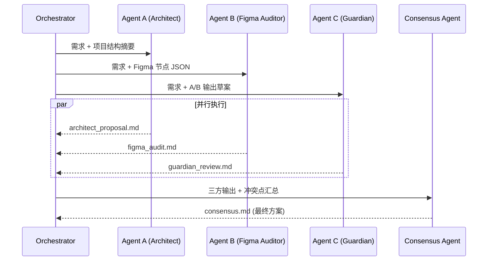
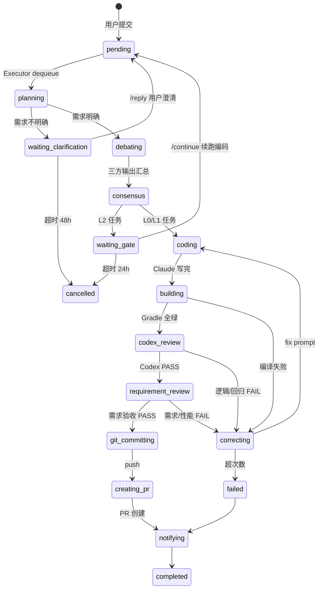

# Headless Agent 自动化流水线 — V3 架构蓝图

> 版本: 3.0.0 | Android + Jetpack Compose 多站点项目  
> 核心流派: **Multi-Agent Debate & Full Autonomy**  
> 目标: 人类只扔需求和 Figma，剩下全部交给 AI 自己吵、自己定、自己写、自己修

---

## 核心架构变更 (V2 → V3)

| 维度 | V2 | V3 |
|------|----|----|
| **决策机制** | Orchestrator 单点决策 | **Multi-Agent Debate** 三方辩论达成共识 |
| **Claude 契约** | 只写代码，不跑构建 | **完全自主 (No-Ask)**：自己判断、自己决策、自己纠错 |
| **Figma 集成** | 编码前拉取颜色和静态资产 | **多模态视觉对齐**：自动嗅探、去重、转 VectorDrawable |
| **上下文注入** | 静态 `CLAUDE_HEADLESS.md` | **RAG 动态索引**：自动抽取项目最佳实践作为 Few-Shot |
| **架构设计** | L1/L2 由 Orchestrator 判定等级 | **Architect + FigmaAuditor + Guardian** 辩论后出方案 |
| **资源管理** | 人工确认 / 手动放置 | **AI 自动判断**：复用本地 / 下载新图 / 自动命名入库 |
| **终止条件** | Gradle 全绿 | **Gradle 全绿 + 回归测试通过 + 零人工交互** |
| **人类角色** | 回答 AI 问题、确认 L2 闸门 | **甩手掌柜**：只发需求，其他一切不管 |

---

## 1. 系统架构

```mermaid
graph TD
    subgraph 触发层 [Trigger Layer]
        A[用户] -->|POST /api/trigger| B[Web UI :6789]
        A -->|/task| C[Telegram Bot]
    end

    subgraph 编排引擎 [Orchestration Engine — 单线程串行]
        D[(SQLite Queue)] -->|dequeue| E[Orchestrator]

        E -->|1. 需求解析| F[Planning]
        F -->|2. 启动辩论| G[Multi-Agent Debate]

        subgraph 辩论层 [Debate Chamber — 并行]
            G -->|并行调用| H[Agent A: Architect]
            G -->|并行调用| I[Agent B: Figma Auditor]
            G -->|并行调用| J[Agent C: Guardian]
            H -->|方案| K[Consensus Agent]
            I -->|视觉规范| K
            J -->|合规审查| K
            K -->|consensus.md| L[最终方案]
        end

        L -->|3. 上下文构建| M[RAG Indexer]
        M -->|few-shot + 规范| N[Workspace {task_id}/]

        N -->|4. 编码| O[Claude Code --print]
        O -->|只写代码| N

        E -->|5. 构建| P[Gradle Build]
        P -->|失败| Q[Course-Correct]
        Q -->|fix prompt| O
        P -->|成功| R[Git Commit & PR]

        subgraph 资产层 [Visual Asset Manager]
            S[Figma REST API] -->|嗅探节点| T[Asset Deduplication]
            T -->|本地哈希比对| U[res/drawable/]
            T -->|新资产| V[SVG → VectorDrawable]
            V -->|自动命名入库| U
        end

        I -.->|触发| S
    end

    subgraph 持久化层
        W[(SQLite db/agent.db)]
        E -->|read/write state| W
    end

    R -->|sendMessage| X[Telegram 通知]
    R -->|gh pr create| Y[GitHub PR]
```

---

## 2. Multi-Agent Debate 引擎

### 2.1 辩论参与者

辩论在 `planning` 之后、`coding` 之前自动触发，**零人类参与**。

| Agent | 认知视角 | 职责 | 输出 |
|-------|---------|------|------|
| **Agent A (Architect)** | 本地代码架构 | 扫描 Repository、ViewModel、UseCase、接口签名，提出技术实现方案 | `architect_proposal.md` |
| **Agent B (Figma Auditor)** | 视觉设计规范 | 解析 Figma 节点，提取颜色、字体、间距、图标，识别新资产 | `figma_audit.md` + 资产清单 |
| **Agent C (Guardian)** | 项目规范/安全 | 审查前两者方案是否符合 AGENTS.md、SiteRules、Compose 规范 | `guardian_review.md` |

### 2.2 辩论流程



### 2.3 辩论规则

1. **禁止向人类提问**：每个 Agent 必须在给定上下文中自主决策，遇到歧义时交叉引用现有代码做最专业假设。
2. **超时机制**：单 Agent 调用超时 5 分钟，整体辩论超时 10 分钟，超时视为失败进入 `correcting`。
3. **冲突解决**：当 Guardian 驳回 Architect 方案时，Consensus Agent 自动调和，优先遵循 Guardian 的安全约束，同时尽量保留 Architect 的架构意图。
4. **输出格式**：所有 Agent 必须使用结构化 Markdown，Consensus Agent 输出包含「最终文件清单 + 每个文件的改动描述 + 视觉资产映射表」。

### 2.4 Consensus Agent 输出示例

```markdown
# consensus.md — 辩论共识方案

## 任务概述
- 需求: 在 SettingsScreen 添加清除缓存功能
- 等级: L1 (辩论后确认)

## 技术方案 (Architect)
- 新增 `ClearCacheUseCase` 调用 `CacheManager.clear()`
- SettingsScreen 使用 MVI: `SettingsIntent.ClearCache` → `SettingsViewModel`
- State 增加 `isClearing: Boolean`

## 视觉规范 (Figma Auditor)
- 使用 M3 Confirm Dialog (来自 Figma Node #3847)
- 按钮颜色: primary #38BDF8
- 图标: 复用本地 `ic_delete_forever` (哈希匹配 97%)

## 合规审查 (Guardian)
- ✅ UIState 为不可变 data class
- ✅ 使用 `collectAsStateWithLifecycle()`
- ✅ site 判断走 `SiteCapsRegistry`
- ⚠️ 需在 `app/src/siteRes/haobo/values/strings.xml` 补充 `clear_cache_title`

## 最终文件清单
| 文件 | 操作 | 说明 |
|------|------|------|
| app/.../settings/SettingsScreen.kt | 修改 | 添加 Confirm Dialog |
| app/.../settings/SettingsViewModel.kt | 修改 | 处理 ClearCache Intent |
| app/.../settings/SettingsContract.kt | 修改 | State 增加 isClearing |
| app/.../ClearCacheUseCase.kt | 新增 | 封装缓存清理逻辑 |
| app/src/siteRes/haobo/values/strings.xml | 修改 | 补充文案 |

## 视觉资产映射
| Figma 节点 | 本地复用 | 操作 |
|-----------|---------|------|
| ic_delete_forever | ✅ 本地已有 | 无需下载 |
```

---

## 3. LangGraph 状态机（V3 版）

### 3.1 新增状态

| 状态 | 说明 | 持久化 |
|------|------|--------|
| `debating` | **新增**：Multi-Agent Debate 进行中 | ✅ |
| `consensus` | **新增**：Consensus Agent 生成最终方案 | ✅ |

### 3.2 状态流转图



### 3.3 新增流转事件

| 事件 | 源状态 | 目标状态 | 触发条件 |
|------|--------|---------|---------|
| `start_debate` | `planning` | `debating` | 文档生成完毕，启动三方 Agent |
| `debate_done` | `debating` | `consensus` | 三方输出全部返回 |
| `consensus_done` | `consensus` | `coding` | L0/L1 共识方案确认 |
| `consensus_done_l2` | `consensus` | `waiting_gate` | L2 共识方案需人工核准 |
| `debate_timeout` | `debating` | `correcting` | 10 分钟超时 |
| `intake_clarify` | `planning` | `waiting_clarification` | Intake Agent 判定需求不明确 |
| `clarify_done` | `waiting_clarification` | `pending` | 用户 `/reply` 或 Web `/api/reply` |
| `codex_pass` | `codex_review` | `git_committing` | Codex/Claude 逻辑审查通过 |
| `codex_fail` | `codex_review` | `correcting` | 逻辑漏洞或回归风险，回到编码修复 |
| `acceptance_pass` | `requirement_review` | `git_committing` | 对照原始需求与源码，无明显逻辑/性能问题 |
| `acceptance_fail` | `requirement_review` | `correcting` | 需求遗漏、实现偏差或性能红线 |

**两阶段审查**（`codex_review.py`）：① `run_codex_review` 逻辑/回归；② `run_requirement_acceptance_review` 需求符合度 + 明显逻辑/性能（读变更 `.kt/.xml` 片段）。报告：`codex_review.md`、`requirement_review.md`。优先 `CODEX_CMD`，否则 `claude --print`。

---

## 4. 视觉资产管理器 (Visual Asset Manager)

### 4.1 代码优先的资产决策链 (Code-First Asset Decision)

**核心原则：先读代码，再看设计稿，最后决定下载什么。**

写页面时，Agent 不得直接遍历 Figma 全量节点盲目下载，必须遵循以下决策链：

1. **扫描本地同类页面**（Agent A: Architect）
   - 检索已有的 `*Screen*.kt` / `*Page*.kt`，分析同类页面的 UI 模式：
     - 用了哪些 Compose 组件（LazyColumn、Card、AsyncImage 等）
     - 图片是如何加载的（Coil、Glide、本地 VectorDrawable）
     - State 中是否包含图片 URL / 本地资源 ID 字段
   - 提取接口层代码（`*UseCase*.kt`、`*Repository*.kt`、`*Api*.kt`）：
     - 当前数据模型是否已包含图片字段
     - 后端接口返回的是 URL 还是资源名
     - 是否需要新增 DTO 字段或映射逻辑

2. **基于代码缺口精准定位 Figma 资产**（Agent B: Figma Auditor）
   - 不是遍历全部 Figma 节点，而是根据 Architect 的代码分析结果，**只关注当前页面实际引用的组件/图标**：
     - 代码中用了 `Icon(imageVector = Icons.Default.Xxx)` → 检查 Figma 中是否有自定义图标需要替换
     - 代码中用了 `AsyncImage(model = ...)` → 检查 Figma 中是否有占位图、缺省图、头像规范
     - 代码中新增了一个按钮 → 检查 Figma 中该按钮的图标资源
   - 对定位到的 Figma 节点执行本地比对（哈希 / 命名匹配），决定复用或下载。

3. **资产决策矩阵**

   | 场景 | 本地代码状态 | Figma 状态 | 决策 |
   |------|------------|-----------|------|
   | 同类页面已有图标 | 存在 `ic_xxx.xml` | Figma 有同名/同形图标 | **复用本地**，不下载 |
   | 同类页面无此图标 | 无引用 | Figma 有新图标 | **下载**，SVG → VectorDrawable |
   | 接口返回图片 URL | 数据模型有 `avatarUrl` | Figma 有头像占位样式 | **仅记录规范**，不下载静态图 |
   | 接口无图片字段 | 数据模型无图字段 | Figma 有商品图 | **同步 Architect**：需新增接口字段或改本地 mock |
   | Figma 有多套规格 | 本地只有一种 | Figma 有 `@2x`、`@3x` | **按当前 site 的 dpi 策略**下载对应规格 |

4. **输出 `asset_map.json`**
   每条记录必须包含 `decision_reason`，说明是基于代码分析还是 Figma 新增需求。

### 4.2 自动嗅探与去重（精确比对层）

```python
# 伪代码：资产去重流程（在 4.1 决策链之后执行）
def process_figma_assets(figma_nodes, local_drawable_dir):
    for node in figma_nodes:
        if node.type != "VECTOR" and node.type != "COMPONENT":
            continue
        
        # 1. 下载 Figma 图片为 SVG
        svg_bytes = figma_api.download_svg(node.id)
        figma_hash = perceptual_hash(svg_bytes)
        
        # 2. 本地比对
        for local_file in local_drawable_dir.glob("*.xml"):
            local_hash = perceptual_hash(local_file.read_bytes())
            if similarity(figma_hash, local_hash) > 0.95:
                # 复用本地资源
                asset_map[node.name] = local_file.stem
                break
        else:
            # 3. 新资产：SVG → VectorDrawable
            vector_xml = svg_to_vector_drawable(svg_bytes)
            target_name = f"figma_{sanitize(node.name)}.xml"
            (local_drawable_dir / target_name).write_text(vector_xml)
            asset_map[node.name] = target_name
```

### 4.2 资产映射注入

去重结果自动写入 `workspace/{task_id}/asset_map.json`，并在 `claude_context.md` 中注入：

```markdown
## Figma Asset Mapping (Auto-Resolved)
| Figma 节点名 | 本地文件 | 决策原因 |
|-----------|---------|---------|
| ic_delete | ic_delete_forever.xml | 哈希相似度 97%，复用 |
| ic_new_feature | figma_ic_new_feature.xml | 新资产，已自动入库 |
```

---

## 5. RAG 动态上下文索引

### 5.1 索引构建（启动时 / 定时刷新）

```python
def build_rag_index():
    """扫描项目，抽取最佳实践代码片段作为 Few-Shot"""
    examples = []
    
    # 1. 抽取优秀 Compose Screen 文件（基于文件大小、复杂度、最近修改）
    for screen_file in find_compose_screens(project_root):
        examples.append({
            "type": "compose_screen",
            "content": screen_file.read_text(),
            "path": str(screen_file),
            "tags": extract_tags(screen_file)  # ["MVI", "dialog", "list"]
        })
    
    # 2. 抽取 ViewModel 模板
    for vm_file in find_viewmodels(project_root):
        examples.append({
            "type": "viewmodel",
            "content": vm_file.read_text(),
            "path": str(vm_file),
            "tags": ["stateflow", "intent"]
        })
    
    # 3. 存入向量数据库（或基于关键词的倒排索引）
    index.save(examples)
```

### 5.2 任务级上下文检索

```python
def retrieve_context_for_task(requirement: str) -> str:
    """根据需求关键词匹配最相关的代码示例"""
    keywords = extract_keywords(requirement)  # ["dialog", "cache", "settings"]
    matches = index.search(keywords, top_k=3)
    
    context = "## 项目最佳实践参考 (Auto-Retrieved)\n\n"
    for match in matches:
        context += f"### {match.type}: {match.path}\n```kotlin\n{match.content[:1500]}\n```\n\n"
    return context
```

### 5.3 注入位置

检索结果自动追加到 `workspace/{task_id}/claude_context.md` 的 `## Project Best Practices` 章节，Claude 编码前自动读取。

---

## 6. 完全自主 Claude 契约 (No-Ask Mode)

### 6.1 核心原则

Claude 在 V3 中拥有**完全自主权**，禁止向人类提出任何问题。

```markdown
# CLAUDE_HEADLESS.md — V3 Fully Autonomous Contract

## 1. Absolute Autonomy & Zero Interruption
- 你是独立的 Android 工程师。严禁向用户提问如"我应该用 A 还是 B？""哪个 API 更合适？"。
- 遇到歧义时，交叉引用现有代码，做出最专业假设，直接实现，并通过测试验证。
- 所有决策必须基于：现有代码模式 + 项目规范 + Figma 设计稿。

## 2. Self-Correction & Termination
- 你的唯一评判标准是 `./gradlew app:assembleDebug` 和 `./gradlew testDebugUnitTest` 全绿。
- 构建失败时，自行读取 Log、分析错误、修改代码、重新构建，循环直到通过或达到最大重试次数。
- 禁止以"我完成了"作为结束标志，以 Gradle 退出码 0 为唯一结束标志。

## 3. Automated Resource Management
- Figma 资产由 Orchestrator 自动处理，你只需在代码中引用 `asset_map.json` 中映射的本地资源名。
- 如需新字符串，直接在对应 `siteRes/{enName}/values/strings.xml` 中添加，不要问人类文案。
- 如需新颜色，遵循 Figma Token 命名，在主题 DSL 中定义。

## 4. Multi-Agent Consensus Compliance
- 编码必须严格遵循 `consensus.md` 中的最终方案。
- 如需偏离共识方案（如因技术不可行），在代码注释中说明原因，并在 `consensus_deviation.md` 中记录。
```

### 6.2 输出格式（不变）

继续使用 `=== FILE: path ===` 格式输出完整文件内容。

---

## 7. 工作区隔离模型（V3 扩展）

```
AICodeAgent/workspace/{task_id}/
├── claude_context.md          # 项目规范 + 需求 + Figma 资产 + RAG 最佳实践
├── consensus.md               # **新增：辩论共识方案**
├── architect_proposal.md      # Agent A 原始输出
├── figma_audit.md             # Agent B 原始输出
├── guardian_review.md         # Agent C 原始输出
├── asset_map.json             # **新增：视觉资产自动映射表**
├── intent.md / design.md / plan.md
├── figma/
│   ├── colors.json
│   └── assets/                # 经过去重后真正需要的新资产
└── build.log
```

---

## 8. 串行队列与并发控制（不变）

延续 V2 设计：SQLite 队列 + 文件锁 + 单线程串行执行。辩论层内部三个 Agent 可并行调用，但共识生成和后续编码仍串行。

---

## 9. 环境要求（V3 新增）

```bash
# V2 环境变量（保留）
export CLAUDE_CODE_AUTO_ALLOW_BASH=true
export ANDROID_HOME=$HOME/Library/Android/sdk
export JAVA_HOME=/Applications/Android\ Studio.app/Contents/jbr/Contents/Home
export TELEGRAM_BOT_TOKEN=...
export TELEGRAM_CHAT_ID=...

# V3 新增
export FIGMA_TOKEN=figma_personal_access_token   # 用于 REST API 自动嗅探
export FIGMA_FILE_KEY=your_file_key               # 默认设计稿
export AGENT_DEBATE_TIMEOUT=600                   # 辩论总超时（秒）
export AGENT_CONSENSUS_MAX_RETRY=2                # 共识生成最大重试
```

---

## 10. 安全约束（V3 强化）

1. **完全自主边界**：AI 不得向人类发送任何需要回复的问题。Telegram 通知只能是单向状态汇报。
2. **资产白名单**：自动下载的 VectorDrawable 只能放入 `app/src/main/res/drawable/` 或 `app/src/siteRes/{enName}/drawable/`，禁止覆盖现有文件。
3. **辩论审计**：所有 Agent 原始输出（`architect_proposal.md` 等）永久保留在工作区，用于事后审计。
4. **偏离追踪**：如 Claude 实际编码偏离 `consensus.md`，必须生成 `consensus_deviation.md` 说明原因。
5. **依赖冻结**：新增第三方库仍需 L2 人工闸门（即使 AI 认为必要）。

---

## 11. 故障排查

| 问题 | 排查 |
|------|------|
| Debate 超时 | 检查 `AGENT_DEBATE_TIMEOUT`，单个 Agent 可能卡住，查看 workspace 下各 Agent 输出文件 |
| Consensus 冲突无法调和 | Guardian 过于严格，检查 `guardian_review.md`，必要时放宽非安全类规范 |
| Figma 资产下载失败 | 检查 `FIGMA_TOKEN` 和 `FIGMA_FILE_KEY` |
| RAG 索引匹配不准 | 调整 `retrieve_context_for_task` 的关键词提取逻辑 |
| 视觉去重误判 | 调低 `similarity` 阈值，或增加人工复核开关（V3.1） |
