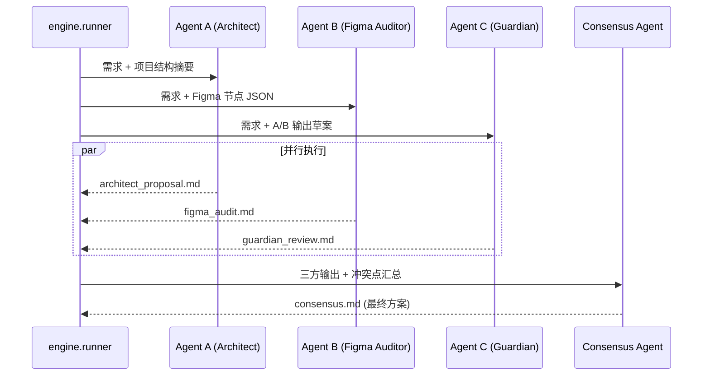
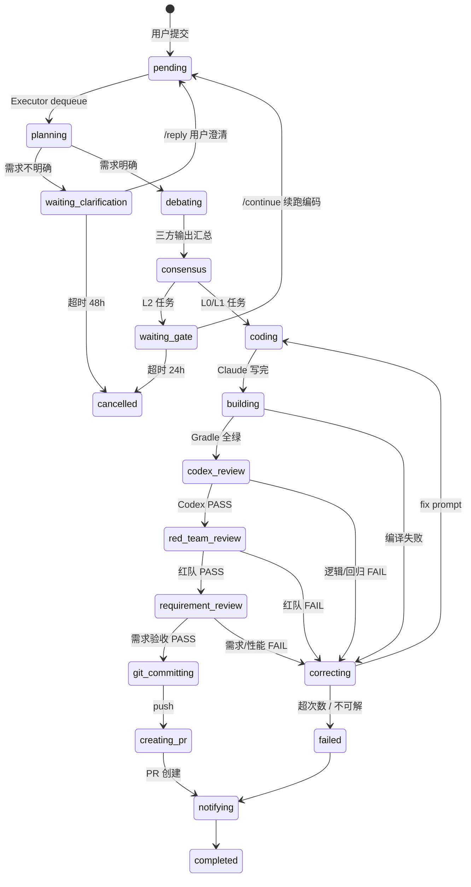

# Headless Agent 自动化流水线 — V4 架构蓝图

> 版本: 4.0.0 | Android + Jetpack Compose 多站点项目  
> 核心流派: **Multi-Agent Debate & Full Autonomy**  
> 目标: 人类只扔需求和 Figma，剩下全部交给 AI 自己吵、自己定、自己写、自己修

---

## 核心架构变更

### V3.2 → V4

| 维度 | V3.2 | V4 |
|------|------|----|
| **编排引擎** | `orchestrator/` 大杂烩：状态机 / 配置加载 / 日志 / 资产 / Figma 全混在一起 | **四层职责分离**：`engine/`、`utils/`、`services/`、`phases/` |
| **状态机实现** | 硬编码 `while` 循环 + `if/elif` 判断 | **显式注册表**：`AgentEngine` + `PhaseHandler` 抽象基类，状态与处理器解耦 |
| **阶段扩展** | 新增状态需修改 `orchestrator/` 多处 | **声明式扩展**：继承 `PhaseHandler`，`engine.register(State, Handler)` 即可 |
| **配置加载** | 模块顶层 `cfg_*` 副作用（导入即 IO） | **惰性加载**：运行时属性读取，避免 import-time 副作用 |
| **异常处理** | 无结构化异常，错误码散落各处 | **分层异常体系**：`AgentRecoverableError` → `correcting` / `AgentFatalError` → `failed` |
| **代码组织** | `orchestrator/codex_review.py`、`orchestrator/red_team_review.py` 工具函数重复 | **统一工具层**：`phases/_review_utils.py` 共享审查工具函数 |
| **向后兼容** | — | `orchestrator/__init__.py` 保留弃用兼容层（`DeprecationWarning`） |

### V3 → V3.2（保留）

| 维度 | V3.0 | V3.2 |
|------|------|------|
| **配置管理** | 纯环境变量 `os.environ.get` | **三层配置**：`default.yaml` → `local.yaml` → 环境变量，`utils.config_loader` 统一读取 |
| **逃逸机制** | 无 | **Escape Detector**：编码前复杂度评估自动升级 L0/L1→L2；循环中不可解检测（连续相同错误指纹） |
| **审查流程** | 两阶段（Codex + 需求验收） | **三阶段**：Codex 逻辑审查 → Red Team 红队攻击视角 → 需求验收审查 |
| **日志系统** | 各模块自行打印 | **统一 RotatingFileHandler**，按配置切分与保留 |

---

## 1. 系统架构

```mermaid
graph TD
    subgraph 触发层 [Trigger Layer]
        A[用户] -->|POST /api/trigger| B[Web UI :6789]
        A -->|/task| C[Telegram Bot]
    end

    subgraph 配置层 [Config Layer]
        AA[config/default.yaml] --> AB[utils.config_loader]
        AC[config/local.yaml] --> AB
        AD[环境变量] --> AB
        AB -->|cfg_str/cfg_int/...| AE[所有模块]
    end

    subgraph 引擎层 [Engine Layer — 显式状态机]
        D[(SQLite Queue)] -->|dequeue| E[engine.runner]
        E -->|build_engine| ENG[engine.engine.AgentEngine]

        ENG -->|register| PH1[phases.planning.PlanningHandler]
        ENG -->|register| PH2[phases.debate.DebateHandler]
        ENG -->|register| PH3[phases.consensus.ConsensusHandler]
        ENG -->|register| PH4[phases.coding.CodingHandler]
        ENG -->|register| PH5[phases.building.BuildingHandler]
        ENG -->|register| PH6[phases.codex_review.CodexReviewHandler]
        ENG -->|register| PH7[phases.red_team_review.RedTeamReviewHandler]
        ENG -->|register| PH8[phases.requirement_review.RequirementReviewHandler]
        ENG -->|register| PH9[phases.correcting.CorrectingHandler]
        ENG -->|register| PH10[phases.git_committing.GitCommittingHandler]
        ENG -->|register| PH11[phases.creating_pr.CreatingPRHandler]
        ENG -->|register| PH12[phases.notifying.NotifyingHandler]
    end

    subgraph 服务层 [Service Layer]
        SVC1[services.ai_client.AIClient]
        SVC2[services.build_service.BuildService]
        SVC3[services.git_service.GitService]
        SVC4[services.notification_service.NotificationService]
        SVC5[services.asset_manager.AssetManager]
        SVC6[services.platform_figma.FigmaResolver]
        SVC7[services.task_service.TaskService]
    end

    subgraph 辩论层 [Debate Chamber — 并行]
        PH2 -->|并行调用| H[Agent A: Architect]
        PH2 -->|并行调用| I[Agent B: Figma Auditor]
        PH2 -->|并行调用| J[Agent C: Guardian]
        H -->|方案| K[Consensus Agent]
        I -->|视觉规范| K
        J -->|合规审查| K
        K -->|consensus.md| L[最终方案]
    end

    L -->|2.5 逃逸检测| AF[utils.escape_detector]
    AF -->|复杂度升级| L

    L -->|3. 上下文构建| M[utils.graph_bridge / RAG]
    M -->|few-shot + 规范| N[Workspace {task_id}/]

    N -->|4. 编码| O[Claude Code --print]
    O -->|只写代码| N

    PH5 -->|5. 构建| P[Gradle Build]
    P -->|失败| PH9[Correcting]
    PH9 -->|fix prompt| O
    P -->|成功| PH6[Review Pipeline]

    subgraph 审查层 [Review Pipeline]
        PH6 -->|PASS| PH7[Red Team]
        PH6 -->|FAIL| PH9
        PH7 -->|PASS| PH8[Requirement Review]
        PH7 -->|FAIL| PH9
        PH8 -->|PASS| PH10[Git Commit]
        PH8 -->|FAIL| PH9
    end

    AF -->|不可解检测| PH9

    subgraph 资产层 [Visual Asset Manager]
        S[Figma REST API] -->|嗅探节点| T[Asset Deduplication]
        T -->|本地哈希比对| U[res/drawable/]
        T -->|新资产| V[SVG → VectorDrawable]
        V -->|自动命名入库| U
    end

    I -.->|触发| S

    subgraph 持久化层
        W[(SQLite db/agent.db)]
        ENG -->|read/write state| W
    end

    PH11 -->|sendMessage| X[Telegram 通知]
    PH11 -->|gh pr create| Y[GitHub PR]
```

---

## 2. 目录结构与职责（V4 新增）

V4 将 V3.2 的 `orchestrator/` 大杂烩拆分为四个职责清晰的顶层包：

```
AICodeAgent/
├── engine/                  # 引擎层：状态机 + 运行器 + 异常体系
│   ├── engine.py            # AgentEngine：PhaseHandler 注册表与状态流转
│   ├── runner.py            # 主循环、服务装配、文件锁
│   ├── state_machine.py     # SQLite 持久化状态机（原 orchestrator/state_machine.py）
│   ├── exceptions.py        # 结构化异常：AgentRecoverableError / AgentFatalError
│   └── config_validator.py  # 启动时配置校验
├── phases/                  # 阶段层：各状态处理器
│   ├── base.py              # PhaseHandler ABC + PhaseResult dataclass
│   ├── _review_utils.py     # 审查共享工具（解析 verdict、diff、prompt 构建）
│   ├── planning.py
│   ├── debate.py
│   ├── consensus.py
│   ├── coding.py
│   ├── building.py
│   ├── codex_review.py
│   ├── red_team_review.py
│   ├── requirement_review.py
│   ├── correcting.py
│   ├── git_committing.py
│   ├── creating_pr.py
│   └── notifying.py
├── services/                # 服务层：外部依赖 + 有状态服务对象
│   ├── ai_client.py         # Claude / Codex CLI 统一封装
│   ├── task_service.py      # 任务 CRUD + 队列操作
│   ├── build_service.py     # Gradle 构建封装
│   ├── git_service.py       # Git 操作封装
│   ├── notification_service.py  # Telegram 通知
│   ├── asset_manager.py     # 视觉资产管理（原 orchestrator/asset_manager.py）
│   └── platform_figma.py    # Figma API 与站点解析（原 orchestrator/platform_figma.py）
├── utils/                   # 工具层：无状态通用工具
│   ├── config_loader.py     # 三层配置加载（原 orchestrator/config_loader.py）
│   ├── logging_config.py    # 统一日志初始化（原 orchestrator/logging_config.py）
│   ├── graph_bridge.py      # CRG / RAG 语义检索（原 orchestrator/graph_bridge.py）
│   ├── escape_detector.py   # 复杂度评估与不可解检测（原 orchestrator/escape_detector.py）
│   └── paths.py             # 项目路径常量
├── gateway/                 # 网关层：外部触发入口
│   ├── web_ui.py
│   └── telegram_bot.py
├── config/
│   ├── default.yaml
│   └── local.yaml
└── orchestrator/            # ⚠️ 已弃用，仅保留兼容层
    └── __init__.py          # DeprecationWarning + 全部 re-export
```

### 模块迁移对照表

| V3.2 路径 | V4 新路径 | 说明 |
|-----------|----------|------|
| `orchestrator/state_machine.py` | `engine/state_machine.py` | 状态定义 + SQLite 持久化 |
| `orchestrator/engine.py` | `engine/engine.py` | 新版显式注册引擎 |
| `orchestrator/runner.py` | `engine/runner.py` | 主循环 + 服务装配 |
| `orchestrator/config_loader.py` | `utils/config_loader.py` | 三层配置加载 |
| `orchestrator/logging_config.py` | `utils/logging_config.py` | 统一日志 |
| `orchestrator/graph_bridge.py` | `utils/graph_bridge.py` | CRG / 语义检索 |
| `orchestrator/escape_detector.py` | `utils/escape_detector.py` | 逃逸检测 |
| `orchestrator/asset_manager.py` | `services/asset_manager.py` | 视觉资产管理 |
| `orchestrator/platform_figma.py` | `services/platform_figma.py` | Figma API 解析 |
| `orchestrator/codex_review.py` | `phases/codex_review.py` + `phases/_review_utils.py` | 工具函数下沉到 `_review_utils` |
| `orchestrator/red_team_review.py` | `phases/red_team_review.py` + `phases/_review_utils.py` | 工具函数下沉到 `_review_utils` |
| `orchestrator/notification_service.py` | `services/notification_service.py` | 已迁移 |
| `orchestrator/ai_client.py` | `services/ai_client.py` | 已迁移 |
| `orchestrator/task_service.py` | `services/task_service.py` | 已迁移 |

---

## 3. V4 显式状态机引擎

### 3.1 设计目标

V3 的编排逻辑是硬编码在 `orchestrator/` 中的 `while` 循环，新增状态需要修改多处代码。V4 引入 **显式注册表模式**：

- **状态（State）** 与 **处理器（PhaseHandler）** 完全解耦
- 新增阶段只需：1) 定义新 `State` 枚举值；2) 继承 `PhaseHandler` 实现逻辑；3) `engine.register(State, Handler)`
- 异常自动捕获并流转到 `correcting` 或 `failed`

### 3.2 PhaseHandler 抽象基类

```python
# phases/base.py
from abc import ABC, abstractmethod
from dataclasses import dataclass
from pathlib import Path
from engine.state_machine import State, Task

@dataclass
class PhaseResult:
    next_state: State
    reason: str = ""

class PhaseHandler(ABC):
    """阶段处理器抽象基类。"""

    def can_handle(self, task: Task) -> bool:
        return True

    @abstractmethod
    def handle(self, task: Task, workspace: Path, **kwargs) -> PhaseResult:
        """执行阶段逻辑，返回下一状态。"""
        ...

    def on_enter(self, task: Task, workspace: Path) -> None:
        """进入阶段前钩子（可选）。"""
        pass

    def on_exit(self, task: Task, workspace: Path, result: PhaseResult) -> None:
        """离开阶段后钩子（可选）。"""
        pass
```

### 3.3 AgentEngine 注册与执行

```python
# engine/engine.py
from pathlib import Path
from typing import Optional
from engine.state_machine import State, Task, transition, save_task, TERMINAL_STATES, WAITING_STATES
from engine.exceptions import AgentRecoverableError, AgentFatalError
from phases.base import PhaseHandler, PhaseResult

class AgentEngine:
    """
    V4 状态机引擎。

    使用方式：
        engine = AgentEngine()
        engine.register(State.CODING, CodingHandler())
        engine.register(State.BUILDING, BuildingHandler())
        ...
        engine.process_task(task)
    """

    def __init__(self, workspace_root: Path | None = None):
        self._handlers: dict[State, PhaseHandler] = {}
        self._workspace_root = workspace_root or Path(__file__).resolve().parents[2] / "workspace"

    def register(self, state: State, handler: PhaseHandler) -> None:
        """注册状态处理器"""
        if state in self._handlers:
            logger.warning("Overriding handler for state %s", state.value)
        self._handlers[state] = handler

    def process_task(self, task: Task) -> None:
        """处理单个任务直到进入终态或等待态。"""
        task_id = task.task_id
        workspace = self._workspace_root / task_id
        workspace.mkdir(parents=True, exist_ok=True)

        while True:
            current = State(task.current_state)
            handler = self._handlers.get(current)

            if not handler:
                transition(task_id, State.FAILED, f"no handler for {current.value}", task)
                break

            result = self._execute_phase(handler, task, workspace)
            if result is None:
                break

            if result.next_state in TERMINAL_STATES | WAITING_STATES:
                transition(task_id, result.next_state, result.reason, task)
                break

            ok = transition(task_id, result.next_state, result.reason, task)
            if not ok:
                transition(task_id, State.FAILED, f"illegal transition {current.value} -> {result.next_state.value}", task)
                break

    def _execute_phase(self, handler: PhaseHandler, task: Task, workspace: Path) -> Optional[PhaseResult]:
        """执行单个阶段，捕获异常并转换为状态流转。"""
        try:
            handler.on_enter(task, workspace)
            result = handler.handle(task, workspace)
            handler.on_exit(task, workspace, result)
            return result
        except AgentRecoverableError as e:
            task.error_log = str(e)
            save_task(task)
            transition(task.task_id, State.CORRECTING, f"recoverable: {e}", task)
            return PhaseResult(State.CORRECTING, f"recoverable: {e}")
        except AgentFatalError as e:
            task.error_log = str(e)
            save_task(task)
            transition(task.task_id, State.FAILED, f"fatal: {e}", task)
            return None
        except Exception as e:
            task.error_log = f"unexpected: {e}"
            save_task(task)
            transition(task.task_id, State.FAILED, f"unexpected: {e}", task)
            return None
```

### 3.4 服务装配（runner.py）

```python
# engine/runner.py
from engine.engine import AgentEngine
from engine.state_machine import State
from services.ai_client import AIClient
from services.build_service import BuildService
from services.git_service import GitService
from services.notification_service import NotificationService
from phases.planning import PlanningHandler
from phases.debate import DebateHandler
from phases.consensus import ConsensusHandler
from phases.coding import CodingHandler
from phases.building import BuildingHandler
from phases.codex_review import CodexReviewHandler
from phases.red_team_review import RedTeamReviewHandler
from phases.requirement_review import RequirementReviewHandler
from phases.correcting import CorrectingHandler
from phases.git_committing import GitCommittingHandler
from phases.creating_pr import CreatingPRHandler
from phases.notifying import NotifyingHandler

def build_engine() -> AgentEngine:
    """构建并配置 AgentEngine，注册所有阶段处理器"""
    ai_client = AIClient()
    build_service = BuildService()
    git_service = GitService()
    notification_service = NotificationService()

    engine = AgentEngine(workspace_root=WORKSPACE_ROOT)

    engine.register(State.PLANNING, PlanningHandler(ai_client=ai_client, notification_service=notification_service))
    engine.register(State.DEBATING, DebateHandler(ai_client=ai_client))
    engine.register(State.CONSENSUS, ConsensusHandler(ai_client=ai_client, notification_service=notification_service))
    engine.register(State.CODING, CodingHandler(ai_client=ai_client, git_service=git_service))
    engine.register(State.BUILDING, BuildingHandler(build_service=build_service))
    engine.register(State.CODEX_REVIEW, CodexReviewHandler(ai_client=ai_client))
    engine.register(State.RED_TEAM_REVIEW, RedTeamReviewHandler(ai_client=ai_client))
    engine.register(State.REQUIREMENT_REVIEW, RequirementReviewHandler(ai_client=ai_client))
    engine.register(State.CORRECTING, CorrectingHandler())
    engine.register(State.GIT_COMMITTING, GitCommittingHandler(git_service=git_service))
    engine.register(State.CREATING_PR, CreatingPRHandler(git_service=git_service))
    engine.register(State.NOTIFYING, NotifyingHandler(notification_service=notification_service))

    return engine
```

### 3.5 结构化异常体系

```python
# engine/exceptions.py
class AgentException(Exception):
    """Agent 异常基类"""
    pass

class AgentRecoverableError(AgentException):
    """
    可恢复异常：触发 correcting 状态，尝试自动修复。
    例如：Gradle 编译失败、Codex 审查不通过、Red Team 发现问题。
    """
    pass

class AgentFatalError(AgentException):
    """
    致命异常：直接流转到 failed，无法自动恢复。
    例如：关键文件丢失、Git 仓库损坏、AI 服务完全不可用。
    """
    pass
```

---

## 4. Multi-Agent Debate 引擎

（V4 逻辑不变，仅更新模块引用）

### 4.1 辩论参与者

辩论在 `planning` 之后、`coding` 之前自动触发，**零人类参与**。

| Agent | 认知视角 | 职责 | 输出 |
|-------|---------|------|------|
| **Agent A (Architect)** | 本地代码架构 | 扫描 Repository、ViewModel、UseCase、接口签名，提出技术实现方案 | `architect_proposal.md` |
| **Agent B (Figma Auditor)** | 视觉设计规范 | 解析 Figma 节点，提取颜色、字体、间距、图标，识别新资产 | `figma_audit.md` + 资产清单 |
| **Agent C (Guardian)** | 项目规范/安全 | 审查前两者方案是否符合 AGENTS.md、SiteRules、Compose 规范 | `guardian_review.md` |

### 4.2 辩论流程



### 4.3 辩论规则

1. **禁止向人类提问**：每个 Agent 必须在给定上下文中自主决策，遇到歧义时交叉引用现有代码做最专业假设。
2. **超时机制**：单 Agent 调用超时 5 分钟，整体辩论超时 10 分钟，超时视为失败进入 `correcting`。
3. **冲突解决**：当 Guardian 驳回 Architect 方案时，Consensus Agent 自动调和，优先遵循 Guardian 的安全约束，同时尽量保留 Architect 的架构意图。
4. **输出格式**：所有 Agent 必须使用结构化 Markdown，Consensus Agent 输出包含「最终文件清单 + 每个文件的改动描述 + 视觉资产映射表」。

---

## 5. LangGraph 状态机（V4 版）

### 5.1 状态流转图



### 5.2 新增流转事件（V4 无变化）

| 事件 | 源状态 | 目标状态 | 触发条件 |
|------|--------|---------|---------|
| `start_debate` | `planning` | `debating` | 文档生成完毕，启动三方 Agent |
| `debate_done` | `debating` | `consensus` | 三方输出全部返回 |
| `consensus_done` | `consensus` | `coding` | L0/L1 共识方案确认 |
| `consensus_done_l2` | `consensus` | `waiting_gate` | L2 共识方案需人工核准 |
| `debate_timeout` | `debating` | `correcting` | 10 分钟超时 |
| `intake_clarify` | `planning` | `waiting_clarification` | Intake Agent 判定需求不明确 |
| `clarify_done` | `waiting_clarification` | `pending` | 用户 `/reply` 或 Web `/api/reply` |
| `codex_pass` | `codex_review` | `red_team_review` | Codex/Claude 逻辑审查通过 |
| `codex_fail` | `codex_review` | `correcting` | 逻辑漏洞或回归风险，回到编码修复 |
| `red_team_pass` | `red_team_review` | `requirement_review` | 红队攻击视角审查通过 |
| `red_team_fail` | `red_team_review` | `correcting` | 发现边界/竞态/安全问题，回到编码修复 |
| `acceptance_pass` | `requirement_review` | `git_committing` | 对照原始需求与源码，无明显逻辑/性能问题 |
| `acceptance_fail` | `requirement_review` | `correcting` | 需求遗漏、实现偏差或性能红线 |
| `escape_unsolvable` | `correcting` | `failed` | 连续相同错误指纹达到阈值，视为不可解 |
| `escape_escalate` | `consensus` | `waiting_gate` | 编码前复杂度评估将 L0/L1 自动升级为 L2 |

---

## 6. 配置系统 (Config Loader)

### 6.1 三层覆盖架构

配置优先级：**环境变量 > `config/local.yaml` > `config/default.yaml`**

```
config/
├── default.yaml    # 基线默认值（随仓库维护，所有配置项必须有默认值）
└── local.yaml      # 本地/敏感覆盖（gitignore，不提交到仓库）
```

### 6.2 使用方式

代码中不再直接调用 `os.environ.get`，统一通过 `utils.config_loader`：

```python
from utils.config_loader import cfg_str, cfg_int, cfg_float, cfg_bool

model = cfg_str("ai.claude_model", "")
timeout = cfg_int("timeouts.debate", 600)
auto_start = cfg_bool("crg.auto_start", False)
delay = cfg_float("retries.base_delay", 3.0)
```

### 6.3 环境变量映射示例

| 环境变量 | 配置键 | 默认值 |
|----------|--------|--------|
| `CLAUDE_MODEL` / `ANTHROPIC_MODEL` | `ai.claude_model` | `""` |
| `AGENT_DEBATE_TIMEOUT` | `timeouts.debate` | `600` |
| `AGENT_CONSENSUS_MAX_RETRY` | `retries.consensus` | `2` |
| `CODEX_REVIEW_MAX_RETRY` | `retries.codex_review` | `2` |
| `CRG_AUTO_START` | `crg.auto_start` | `false` |
| `AGENT_SKIP_CLARIFICATION` | `features.skip_clarification` | `false` |

空字符串环境变量**不会**覆盖默认值。

### 6.4 惰性配置模式（V4 新增）

V4 禁止模块顶层直接调用 `cfg_*`（避免 import-time IO 副作用）。推荐模式：

```python
# ✅ V4 推荐：函数内按需读取
def build_prompt(requirement: str) -> str:
    model = cfg_str("ai.claude_model", "")
    max_tokens = cfg_int("ai.max_tokens", 4096)
    return f"...{requirement}..."

# ❌ V3 反模式：模块顶层副作用
# MODEL = cfg_str("ai.claude_model", "")  # import 时就读文件 + 环境变量
```

对于需要全局常量的场景，使用 lazy property：

```python
# services/ai_client.py — 改造后（好）
class AIClient:
    """AI 客户端：支持 Claude CLI 与 Codex CLI。"""

    @property
    def model(self) -> str:
        return cfg_str("ai.claude_model", "")

    @property
    def max_tokens(self) -> int:
        return cfg_int("ai.max_tokens", 4096)
```

---

## 7. 逃逸检测机制 (Escape Detector)

### 7.1 设计目标

防止 Agent 在不可解问题上无限循环，或在低等级任务中盲目处理超出能力范围的复杂变更。

### 7.2 复杂度升级（编码前）

在共识生成后、编码开始前，`utils.escape_detector.assess_complexity()` 分析 `consensus.md`：

| 触发条件 | 行为 |
|----------|------|
| 文件数 > `escape.file_threshold`（默认 10） | 标记为复杂 |
| 跨模块改动（涉及多个 `feature/`、`data/`、`domain/` 目录） | 标记为复杂 |
| 触碰核心文件（`KoinModule.kt`、`SiteRules.kt`、`OkHttpClientProvider` 等） | 标记为复杂 |

若任务等级为 L0/L1 且满足任一复杂条件，**自动升级为 L2**，进入 `waiting_gate` 等待人工核准。

### 7.3 不可解检测（编码循环中）

在 `correcting` → `coding` 的循环中，每次 Gradle 构建失败都会记录错误指纹（提取关键错误信息，去除行号等噪音）。

```python
# utils/escape_detector.py
def detect_unsolvable(error_history: list[str]) -> tuple[bool, str]:
    """连续 N 次相同指纹视为不可解"""
```

- 当连续 `escape.unsolvable_repeat`（默认 2）次出现**相同**错误指纹时，判定为不可解。
- 任务直接流转到 `failed`，并写入 `workspace/{task_id}/escape_log.md` 记录逃逸原因和上下文。

---

## 8. Red Team 红队审查

### 8.1 定位与原则

Red Team 是**独立于 Codex 逻辑审查**的第三道防线，以**攻击者视角**审视实现：

- 不重复 Codex 已覆盖的常规逻辑检查
- 专注于"如果我是 QA/黑客/后期维护者，我会怎么让这段代码出问题"
- 可配置仅对指定任务等级启用（默认仅 L2）

### 8.2 审查维度

`phases/red_team_review.py` 的 prompt 覆盖 7 个攻击维度：

1. **边界条件攻击**：空列表、极大/极小值、特殊字符输入
2. **竞态与并发**：多线程、状态同步、生命周期泄漏
3. **空指针与异常**：NPE、类型转换失败、未捕获异常
4. **安全与隐私**：硬编码敏感信息、日志泄露、权限绕过
5. **多站点兼容性**：修改是否误伤其他 `enName` 站点
6. **过度设计**：不必要的抽象、过早优化、引入未使用依赖
7. **可维护性**：魔法值、重复代码、违背项目规范

### 8.3 流程位置

```
building 全绿
    → codex_review（逻辑/回归）PASS
    → red_team_review（攻击视角）PASS/FAIL
    → requirement_review（需求符合度）PASS/FAIL
    → git_committing
```

Red Team FAIL 时直接回到 `correcting`，不进入需求验收审查。

### 8.4 配置

```yaml
features:
  red_team_enabled: true
  red_team_for_levels: "L2"      # 逗号分隔，如 "L1,L2"
  red_team_max_retry: 1
```

---

## 9. 视觉资产管理器 (Visual Asset Manager)

### 9.1 代码优先的资产决策链 (Code-First Asset Decision)

**核心原则：先读代码，再看设计稿，最后决定下载什么。**

写页面时，Agent 不得直接遍历 Figma 全量节点盲目下载，必须遵循以下决策链：

1. **扫描本地同类页面**（Agent A: Architect）
2. **基于代码缺口精准定位 Figma 资产**（Agent B: Figma Auditor）
3. **资产决策矩阵**

   | 场景 | 本地代码状态 | Figma 状态 | 决策 |
   |------|------------|-----------|------|
   | 同类页面已有图标 | 存在 `ic_xxx.xml` | Figma 有同名/同形图标 | **复用本地**，不下载 |
   | 同类页面无此图标 | 无引用 | Figma 有新图标 | **下载**，SVG → VectorDrawable |
   | 接口返回图片 URL | 数据模型有 `avatarUrl` | Figma 有头像占位样式 | **仅记录规范**，不下载静态图 |
   | 接口无图片字段 | 数据模型无图字段 | Figma 有商品图 | **同步 Architect**：需新增接口字段或改本地 mock |
   | Figma 有多套规格 | 本地只有一种 | Figma 有 `@2x`、`@3x` | **按当前 site 的 dpi 策略**下载对应规格 |

4. **输出 `asset_map.json`**：每条记录必须包含 `decision_reason`。

### 9.2 自动嗅探与去重（精确比对层）

```python
# services/asset_manager.py — 核心流程
def process_visual_assets(figma_nodes, local_drawable_dir):
    for node in figma_nodes:
        if node.type not in ("VECTOR", "COMPONENT"):
            continue

        svg_bytes = fetch_figma_svg_via_api(node.id)
        figma_hash = _svg_path_hash(svg_bytes)

        # 本地比对
        for local_file in local_drawable_dir.glob("*.xml"):
            local_hash = _vector_path_hash(local_file.read_bytes())
            if _icon_name_similarity(figma_hash, local_hash) > _similarity_threshold():
                asset_map[node.name] = local_file.stem
                break
        else:
            # 新资产：SVG → VectorDrawable
            vector_xml = svg_to_vector_drawable(svg_bytes)
            target_name = f"figma_{sanitize_asset_name(node.name)}.xml"
            (local_drawable_dir / target_name).write_text(vector_xml)
            asset_map[node.name] = target_name
```

### 9.3 资产映射注入

去重结果自动写入 `workspace/{task_id}/asset_map.json`，并在 `claude_context.md` 中注入：

```markdown
## Figma Asset Mapping (Auto-Resolved)
| Figma 节点名 | 本地文件 | 决策原因 |
|-----------|---------|---------|
| ic_delete | ic_delete_forever.xml | 哈希相似度 97%，复用 |
| ic_new_feature | figma_ic_new_feature.xml | 新资产，已自动入库 |
```

---

## 10. RAG 动态上下文索引

### 10.1 索引构建（启动时 / 定时刷新）

```python
# utils/graph_bridge.py
def build_rag_index():
    """扫描项目，抽取最佳实践代码片段作为 Few-Shot"""
    examples = []
    for screen_file in find_compose_screens(project_root):
        examples.append({
            "type": "compose_screen",
            "content": screen_file.read_text(),
            "path": str(screen_file),
            "tags": extract_tags(screen_file)
        })
    index.save(examples)
```

### 10.2 任务级上下文检索

```python
def retrieve_context_for_task(requirement: str) -> str:
    keywords = extract_keywords(requirement)
    matches = index.search(keywords, top_k=3)
    context = "## 项目最佳实践参考 (Auto-Retrieved)\n\n"
    for match in matches:
        context += f"### {match.type}: {match.path}\n```kotlin\n{match.content[:1500]}\n```\n\n"
    return context
```

### 10.3 注入位置

检索结果自动追加到 `workspace/{task_id}/claude_context.md` 的 `## Project Best Practices` 章节，Claude 编码前自动读取。

---

## 11. 完全自主 Claude 契约 (No-Ask Mode)

### 11.1 核心原则

Claude 在 V3/V4 中拥有**完全自主权**，禁止向人类提出任何问题。

```markdown
# CLAUDE_HEADLESS.md — V4 Fully Autonomous Contract

## 1. Absolute Autonomy & Zero Interruption
- 你是独立的 Android 工程师。严禁向用户提问如"我应该用 A 还是 B？"
- 遇到歧义时，交叉引用现有代码，做出最专业假设，直接实现，并通过测试验证。
- 所有决策必须基于：现有代码模式 + 项目规范 + Figma 设计稿。

## 2. Self-Correction & Termination
- 你的唯一评判标准是 `./gradlew app:assembleDebug` 和 `./gradlew testDebugUnitTest` 全绿。
- 构建失败时，自行读取 Log、分析错误、修改代码、重新构建，循环直到通过或达到最大重试次数。
- 禁止以"我完成了"作为结束标志，以 Gradle 退出码 0 为唯一结束标志。

## 3. Automated Resource Management
- Figma 资产由 AssetManager 自动处理，你只需在代码中引用 `asset_map.json` 中映射的本地资源名。
- 如需新字符串，直接在对应 `siteRes/{enName}/values/strings.xml` 中添加，不要问人类文案。
- 如需新颜色，遵循 Figma Token 命名，在主题 DSL 中定义。

## 4. Multi-Agent Consensus Compliance
- 编码必须严格遵循 `consensus.md` 中的最终方案。
- 如需偏离共识方案（如因技术不可行），在代码注释中说明原因，并在 `consensus_deviation.md` 中记录。
```

### 11.2 输出格式（不变）

继续使用 `=== FILE: path ===` 格式输出完整文件内容。

---

## 12. 工作区隔离模型（V4 扩展）

```
AICodeAgent/workspace/{task_id}/
├── claude_context.md          # 项目规范 + 需求 + Figma 资产 + RAG 最佳实践
├── consensus.md               # 辩论共识方案
├── architect_proposal.md      # Agent A 原始输出
├── figma_audit.md             # Agent B 原始输出
├── guardian_review.md         # Agent C 原始输出
├── asset_map.json             # 视觉资产自动映射表
├── codex_review.md            # Codex 逻辑审查报告
├── red_team_audit.md          # 红队攻击视角审查报告
├── requirement_review.md      # 需求验收审查报告
├── escape_log.md              # 逃逸记录（不可解/复杂度升级）
├── intent.md / design.md / plan.md
├── figma/
│   ├── colors.json
│   └── assets/                # 经过去重后真正需要的新资产
└── build.log
```

---

## 13. 串行队列与并发控制（不变）

延续 V2/V3 设计：SQLite 队列 + 文件锁 + 单线程串行执行。辩论层内部三个 Agent 可并行调用，但共识生成和后续编码仍串行。

---

## 14. 环境要求（V4 更新）

V4 继续使用三层配置管理环境：

```bash
# 1. 基础构建环境（仍通过环境变量，因涉及系统路径）
export CLAUDE_CODE_AUTO_ALLOW_BASH=true
export ANDROID_HOME=$HOME/Library/Android/sdk
export JAVA_HOME=/Applications/Android\ Studio.app/Contents/jbr/Contents/Home

# 2. 其余配置写入 config/local.yaml（gitignore，不提交）
cat > config/local.yaml <<EOF
ai:
  codex_cmd: "codex exec -a never --"
figma:
  token: "figma_personal_access_token"
  file_key: "your_file_key"
timeouts:
  debate: 600
retries:
  consensus: 2
notifications:
  telegram:
    bot_token: "..."
    chat_id: "..."
EOF
```

环境变量仍可用于 CI/CD 临时覆盖或敏感信息注入。完整映射表见 README.md「配置系统」章节。

---

## 15. 安全约束（V4 强化）

1. **完全自主边界**：AI 不得向人类发送任何需要回复的问题。Telegram 通知只能是单向状态汇报。
2. **资产白名单**：自动下载的 VectorDrawable 只能放入 `app/src/main/res/drawable/` 或 `app/src/siteRes/{enName}/drawable/`，禁止覆盖现有文件。
3. **辩论审计**：所有 Agent 原始输出（`architect_proposal.md` 等）永久保留在工作区，用于事后审计。
4. **偏离追踪**：如 Claude 实际编码偏离 `consensus.md`，必须生成 `consensus_deviation.md` 说明原因。
5. **依赖冻结**：新增第三方库仍需 L2 人工闸门（即使 AI 认为必要）。
6. **配置隔离**：敏感配置（Token、API Key）必须放在 `config/local.yaml`（gitignore），禁止写入 `default.yaml`。
7. **逃逸审计**：所有复杂度升级和不可解判定必须写入 `escape_log.md`，便于事后分析 Agent 能力边界。

---

## 16. 向后兼容（V4 新增）

### 16.1 orchestrator 兼容层

`orchestrator/__init__.py` 已重写为弃用兼容层，保留所有旧 import 路径：

```python
# orchestrator/__init__.py
import warnings
warnings.warn(
    "orchestrator 包已弃用。请直接从 engine/、utils/、services/、phases/ 导入对应模块",
    DeprecationWarning,
    stacklevel=2,
)

# 全部 re-export
from engine.state_machine import State, Task, transition, save_task, get_task
from utils.config_loader import cfg_str, cfg_int, cfg_float, cfg_bool
from utils.logging_config import setup_logging, get_logger
from utils.escape_detector import assess_complexity, detect_unsolvable
from services.asset_manager import scan_local_drawable_dirs, process_visual_assets
from services.platform_figma import resolve_platform_site, list_platform_sites_for_ui
from phases._review_utils import parse_codex_verdict, build_codex_review_prompt
# ... 更多 re-export
```

**迁移建议**：
- 新代码直接使用新路径（`from engine.state_machine import ...`）
- 旧代码在运行时看到 `DeprecationWarning`，但功能正常
- 下一主版本（V5）将移除兼容层

---

## 17. 故障排查

| 问题 | 排查 |
|------|------|
| 配置未生效 | 检查 `config/local.yaml` 语法；确认环境变量非空；查看 `utils.config_loader` 日志 |
| Debate 超时 | 检查 `timeouts.debate`，单个 Agent 可能卡住，查看 workspace 下各 Agent 输出文件 |
| Consensus 冲突无法调和 | Guardian 过于严格，检查 `guardian_review.md`，必要时放宽非安全类规范 |
| L0/L1 任务突然进入 waiting_gate | 检查 `escape_log.md`，可能是复杂度自动升级 |
| 编码循环突然终止为 failed | 检查 `escape_log.md`，可能是不可解检测触发 |
| Red Team 过于严格 | 调整 `features.red_team_for_levels` |
| Figma 资产下载失败 | 检查 `figma.token` 和 `figma.file_key` |
| RAG 索引匹配不准 | 调整 `utils.graph_bridge` 的关键词提取逻辑 |
| 视觉去重误判 | 调低 `figma.hash_similarity` 阈值 |
| **V4 新增：import 找不到 orchestrator 子模块** | 已迁移到 engine/utils/services/phases，查看「模块迁移对照表」 |
| **V4 新增：测试 monkeypatch 路径失效** | 旧路径 `orchestrator.state_machine` 改为 `engine.state_machine` |
