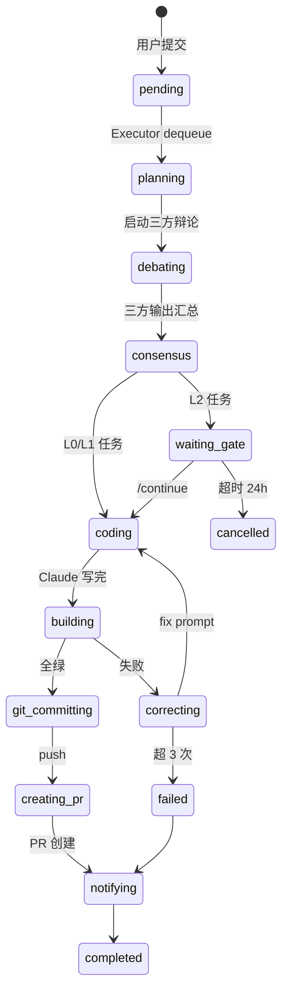

# 🤖 Android Headless Agent 自动化流水线 V3

> 版本: 3.0.0 | Android + Jetpack Compose 多站点项目  
> 核心流派: **Multi-Agent Debate & Full Autonomy**  
> 目标: 人类只扔需求和 Figma，剩下全部交给 AI 自己吵、自己定、自己写、自己修

---

## V3 核心改进

| 维度 | V2 | V3 |
|------|----|----|
| **决策机制** | Orchestrator 单点决策 | **Multi-Agent Debate** 三方辩论达成共识 |
| **Claude 契约** | 只写代码，不跑构建 | **完全自主 (No-Ask)**：自己判断、自己决策、自己纠错 |
| **Figma 集成** | 编码前拉取颜色和静态资产 | **多模态视觉对齐**：自动嗅探、去重、转 VectorDrawable |
| **上下文注入** | 静态 `CLAUDE_HEADLESS.md` | **RAG 动态索引**：自动抽取项目最佳实践作为 Few-Shot |
| **架构设计** | L1/L2 由 Orchestrator 判定等级 | **Architect + FigmaAuditor + Guardian** 辩论后出方案 |
| **资源管理** | 人工确认 / 手动放置 | **AI 自动判断**：复用本地 / 下载新图 / 自动命名入库 |
| **终止条件** | Gradle 全绿 | **Gradle 全绿 + 零人工交互** |
| **人类角色** | 回答 AI 问题、确认 L2 闸门 | **甩手掌柜**：只发需求，其他一切不管 |

---

## 系统架构

```mermaid
graph TD
    A[用户] -->|POST /api/trigger| B[Web UI :6789]
    A -->|/task| C[Telegram Bot]
    B -->|enqueue| D[(SQLite Queue)]
    C -->|enqueue| D
    D -->|dequeue| E[Serial Executor]
    E -->|file lock| F[Workspace {task_id}/]

    E -->|1. Planning| G[Multi-Agent Debate]
    G -->|Agent A| H[Architect]
    G -->|Agent B| I[Figma Auditor]
    G -->|Agent C| J[Guardian]
    H -->|proposal| K[Consensus Agent]
    I -->|audit| K
    J -->|review| K
    K -->|consensus.md| F

    F -->|2. Coding| L[Claude Code --print]
    L -->|只写代码| F
    E -->|3. Build| M[Gradle Build]
    M -->|失败| N[Course-Correct]
    N -->|fix prompt| L
    M -->|成功| O[Git Commit & PR]

    P[Figma REST API] -->|自动嗅探| Q[Asset Deduplication]
    Q -->|复用| R[res/drawable/]
    Q -->|新资产| S[SVG → VectorDrawable]
    S -->|自动入库| R

    O -->|Telegram API| T[手机通知]
    O -->|gh pr create| U[GitHub PR]
```

---

## LangGraph 状态机



---

## 目录结构

```
headlessAgent/
├── README.md                        # 本文件
├── ARCHITECTURE_v3.md               # V3 详细架构蓝图
├── IMPLEMENTATION_v2.md             # V2 源码参考（供回溯）
├── setup.md                         # 环境搭建指南
│
├── gateway/
│   ├── web_ui_v2.py                 # Web UI 网关 (SQLite + 动态站点)
│   └── telegram_bot_v2.py           # Telegram Bot (SQLite + L2 持久化)
│
├── orchestrator/
│   ├── executor.py                  # 串行任务执行器 + 文件锁
│   ├── orchestrator.py              # 核心编排器 (含 Multi-Agent Debate)
│   ├── state_machine.py             # LangGraph 状态机 + SQLite
│   └── CLAUDE_HEADLESS.md           # V3 完全自主契约
│
├── scripts/
│   ├── build_monitor.sh             # Gradle 超时监控
│   ├── course_correct.py            # 统一错误解析器
│   ├── notify.sh                    # Telegram 通知
│   └── figma_fetch.sh               # Figma 设计稿拉取
│
└── workspace/                       # 运行时创建 (每个任务独立沙箱)
    └── {task_id}/
        ├── claude_context.md        # 任务上下文 (规范 + RAG + Consensus)
        ├── consensus.md             # 辩论共识方案
        ├── architect_proposal.md    # Agent A 原始输出
        ├── architect_proposal_output.md
        ├── figma_audit.md           # Agent B 原始输入
        ├── figma_audit_output.md    # Agent B 原始输出
        ├── guardian_review.md       # Agent C 原始输入
        ├── guardian_review_output.md # Agent C 原始输出
        ├── asset_map.json           # 视觉资产自动映射表
        ├── intent.md / design.md / plan.md
        ├── figma/                   # 经过去重后的新资产
        └── build.log                # Gradle 构建日志
```

---

## 快速开始

### 1. 环境依赖

```bash
# Python 3.9+
pip3 install requests

# GitHub CLI
brew install gh
gh auth login

# Claude Code CLI
npm install -g @anthropic-ai/claude-code
```

### 2. 环境变量

```bash
# V2 保留
export CLAUDE_CODE_AUTO_ALLOW_BASH=true
export ANDROID_HOME=$HOME/Library/Android/sdk
export JAVA_HOME=/Applications/Android\ Studio.app/Contents/jbr/Contents/Home
export TELEGRAM_BOT_TOKEN=...
export TELEGRAM_CHAT_ID=...

# V3 新增
export FIGMA_TOKEN=figma_personal_access_token
# FIGMA_FILE_KEY 可选；提交任务时填 site_hint（enName 或中文简称）即可从 platform-figma-list 解析
export AGENT_DEBATE_TIMEOUT=600
export AGENT_CONSENSUS_MAX_RETRY=2
```

### 3. 启动

```bash
# 1. 启动串行执行器（后台，核心引擎）
python3 AICodeAgent/orchestrator/executor.py &

# 2. 启动 Web UI 网关
python3 AICodeAgent/gateway/web_ui_v2.py

# 3. 或启动 Telegram Bot
python3 AICodeAgent/gateway/telegram_bot_v2.py
```

### 4. 提交测试任务

```bash
# L0 轻量任务测试
curl -X POST http://localhost:6789/api/trigger \
  -H "Content-Type: application/json" \
  -d '{"raw_requirement":"在 strings.xml 里加 clear_cache 字符串","level":"L0"}'

# L1 常规任务（触发 Multi-Agent Debate）
curl -X POST http://localhost:6789/api/trigger \
  -H "Content-Type: application/json" \
  -d '{"raw_requirement":"在 SettingsScreen 添加清除缓存 M3 Confirm Dialog","level":"L1","site_hint":"haobo"}'
```

---

## 关键设计决策

1. **Multi-Agent Debate**：Architect + FigmaAuditor + Guardian 三方辩论，Consensus Agent 仲裁，零人类参与决策。
2. **完全自主 (No-Ask)**：Claude 禁止向人类提问，歧义时交叉引用现有代码做最专业假设。
3. **RAG 动态上下文**：自动检索项目最近修改的 Compose Screen / ViewModel 作为 Few-Shot 示例。
4. **视觉资产自动管理**：Figma 节点嗅探 → 本地哈希去重 → SVG 转 VectorDrawable → 自动命名入库。
5. **串行执行**：文件锁 + SQLite 队列，避免多 Claude 操作同一 git working tree。
6. **工作区隔离**：每个任务独立 `workspace/{task_id}/`， debates 原始输出永久保留用于审计。

---

## 与现有开发协议对接

| 协议组件 | V3 对接方式 |
|---------|-----------|
| 递归式协议 6 阶段 | Debate + Consensus 自动走完前 4 阶段，L2 在 `waiting_gate` 暂停 |
| `doc/tasks/{name}/` | Orchestrator 生成到 `workspace/{task_id}/` |
| `CLAUDE.md` | 不再覆盖根目录，任务上下文写入 `workspace/{task_id}/claude_context.md` |
| `AGENTS.md` | 规范融入 `CLAUDE_HEADLESS.md`，Guardian 负责强制执行 |
| `.skills/recursive-dev-protocol` | 等级判定逻辑复用，Debate 后可能调整等级 |
| `get_impact_radius` MCP | Architect Agent 编码前自动调用 |

---

## 扩展计划

- [x] Visual Asset Manager（哈希去重 + SVG→VectorDrawable + `asset_map.json`）
- [x] Code Review Graph 桥接（`graph_bridge.py`，可选 `CRG_AUTO_START=1`）
- [x] Debate 并行 + 超时
- [x] L2 `/continue` 续跑编码阶段
- [ ] Maestro 流程测试集成
- [ ] Paparazzi 截图回归（对比 Figma 基线）
- [ ] 多站点并行 PR
- [ ] 企业微信/钉钉通知适配
- [ ] 向量数据库 RAG（替代当前关键词 + 图谱混合检索）
