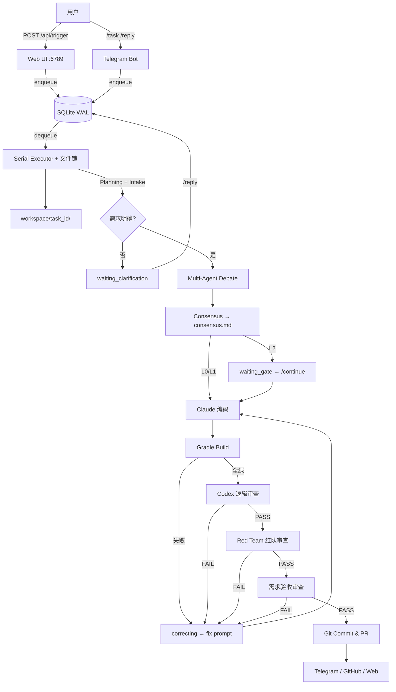
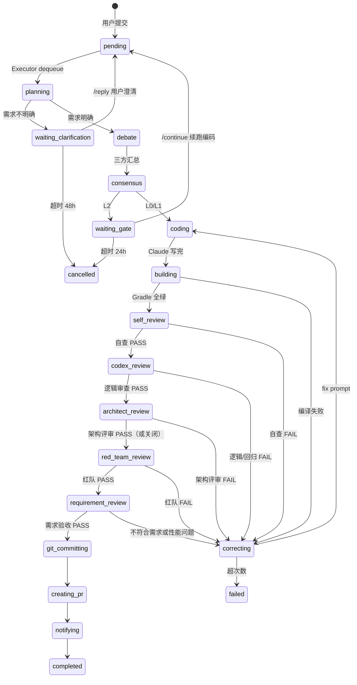

# 🤖 Android Headless Agent 自动化流水线 V4

> 版本: 4.0.0 | Android + Jetpack Compose 多站点项目
> 核心流派: **Multi-Agent Debate + 可控人工闸门**
> 目标: 人类扔需求和 Figma；**需求不清时先反问**；方案由 AI 辩论；编码/构建/逻辑审查尽量全自动

---

## V4 核心能力

| 维度 | 说明 |
|------|------|
| **决策机制** | Architect + FigmaAuditor + Guardian **三方辩论** → Consensus 出 `consensus.md` |
| **需求 Intake** | Planning 后若信息不足 → **`waiting_clarification`**，用户 `/reply` 或 Web 澄清后再辩论 |
| **编码契约** | Claude `--print` **只写代码**；Gradle / git / PR 由 Orchestrator 执行 |
| **构建纠错** | Gradle 失败 → `correcting` → fix prompt 重试（`max_retries` 默认 3） |
| **逻辑审查** | 全绿 → `codex_review`（逻辑/漏洞/回归）→ `red_team_review`（红队攻击视角，可配置仅 L2）→ `requirement_review`（对照原始需求 + 明显逻辑/性能），任一 FAIL 再修 |
| **L2 闸门** | 辩论+共识后暂停 `waiting_gate`，`/continue` 或 Web 核准后再编码 |
| **L0 快路径** | 跳过辩论，最小共识后直接编码 |
| **视觉资产** | Code-First：`asset_analysis` → Figma 按需拉取 → `asset_map.json` |
| **图谱上下文** | 可选 `graph_bridge` + CRG HTTP：语义检索 + 影响面（Codex/Architect 用） |

### 与「完全 No-Ask」的区别

| 场景 | 行为 |
|------|------|
| 需求模糊（缺页面/站点/验收标准等） | **必须反问用户**，不进入辩论 |
| L2 复杂任务 | 共识后 **人工核准** 再编码 |
| 编码/构建/审查阶段 | **不向人类提问**，自动 fix |

---

## 系统架构



---

## LangGraph 状态机



持久化：`engine/state_machine.py` + `data/agent.db`（WAL）。非法流转会拒绝并打日志。

---

## 目录结构

```
AICodeAgent/
├── README.md
├── ARCHITECTURE_v4.md          # 详细蓝图
├── setup.md
├── Dockerfile                  # Docker 镜像构建
├── docker-compose.yml          # Docker Compose 编排
├── .env.example                # 环境变量模板
├── start.sh / stop.sh / status.sh  # 一键启停与状态查看
│
├── gateway/
│   ├── web_ui.py                 # Web + /api/trigger|continue|reply|cancel
│   └── telegram_bot.py           # /task /reply /continue /cancel
│
├── config/
│   ├── default.yaml              # 默认配置（三层配置之基线）
│   └── local.yaml                # 本地覆盖（gitignore）
│
├── engine/
│   ├── runner.py                 # 串行队列 + 超时清理
│   ├── core.py                   # V4 主编排引擎（PhaseHandler 注册表）
│   ├── state_machine.py          # 状态机 + SQLite WAL
│   ├── exceptions.py             # 自定义异常
│   ├── config_validator.py       # 配置预校验
│   └── __init__.py
│
├── phases/
│   ├── base.py                   # PhaseHandler 基类与 PhaseResult
│   ├── planning.py               # 需求分析与规划
│   ├── debate.py                 # 多 Agent 辩论
│   ├── consensus.py              # 共识汇总
│   ├── coding.py                 # Claude 编码
│   ├── building.py               # Gradle 构建
│   ├── self_review.py            # 构建后自审查（V4 新增）
│   ├── codex_review.py           # 构建后逻辑/回归审查
│   ├── architect_review.py       # 架构/设计质量评审（V4 新增，可选）
│   ├── red_team_review.py        # 红队攻击视角审查（L2 可选）
│   ├── requirement_review.py     # 需求验收审查
│   ├── correcting.py             # 自动纠错重试
│   ├── git_committing.py         # Git 提交
│   ├── creating_pr.py            # GitHub PR 创建
│   ├── notifying.py              # 通知分发
│   └── _review_utils.py          # 审查阶段共享工具
│
├── services/
│   ├── ai_client.py              # LLM 客户端封装
│   ├── task_service.py           # 任务生命周期管理
│   ├── build_service.py          # 构建服务
│   ├── git_service.py            # Git 操作封装
│   ├── notification_service.py   # 通知服务
│   ├── asset_manager.py          # 资产嗅探与 asset_map
│   └── platform_figma.py         # Figma 站点解析
│
├── utils/
│   ├── config_loader.py          # 三层配置加载器（default→local→env）
│   ├── escape_detector.py        # 逃逸检测（不可解识别 + 复杂度升级）
│   ├── graph_bridge.py           # CRG 语义检索 / 影响面
│   ├── logging_config.py         # 统一日志（RotatingFileHandler）
│   └── paths.py                  # 路径常量
│
├── orchestrator/
│   └── __init__.py               # V3 兼容层（已弃用）
│
├── scripts/
│   ├── build_monitor.sh
│   ├── figma_fetch.sh
│   ├── notify.sh
│   ├── smoke_l0.sh
│   └── course_correct.py
│
├── install/
│   └── lib/
│       └── agent_paths.sh        # 路径常量（供 shell 脚本 source）
│
├── tests/
│   ├── conftest.py
│   ├── integration/
│   │   └── test_l0_smoke.py
│   └── unit/
│       ├── test_asset_manager.py
│       ├── test_config_loader.py
│       ├── test_state_machine.py
│       ├── test_codex_review.py
│       ├── test_escape_detector.py
│       ├── phases/
│       │   ├── test_state_flow.py
│       │   ├── test_coding.py
│       │   ├── test_correcting.py
│       │   ├── test_planning.py
│       │   └── test_review_utils.py
│       ├── engine/
│       │   └── test_engine.py
│       └── services/
│           ├── test_build_service.py
│           ├── test_git_service.py
│           └── test_notification_service.py
│
├── data/                         # 运行时（gitignore）
├── dist/                         # 构建产物（gitignore）
└── workspace/{task_id}/          # 任务沙箱（gitignore）
    ├── clarification_questions.md
    ├── user_clarification.md
    ├── consensus.md
    ├── codex_review.md
    ├── red_team_audit.md
    ├── requirement_review.md
    ├── asset_map.json
    ├── escape_log.md
    └── ...
```

**部署位置**：本目录默认在 Android 工程根目录下（`wm/AICodeAgent/`），`PROJECT_ROOT` 指向上一级；`start.sh` 依赖该布局。

---

## 快速开始

### 1. 环境依赖

```bash
# Python 依赖
pip3 install -r requirements.txt

# 或虚拟环境（推荐）
cd AICodeAgent
python3 -m venv .venv
source .venv/bin/activate
pip install -r requirements.txt

# GitHub CLI（自动创建 PR）
brew install gh
gh auth login

# Claude Code CLI（编码主引擎）
npm install -g @anthropic-ai/claude-code

# 可选：OpenAI Codex CLI（设置 CODEX_CMD 后启用）
# npm install -g @openai/codex

# 验证
claude --version
gh --version
python3 -m pytest --version
```

### 2. 配置系统（三层覆盖）

配置优先级：**环境变量 > `config/local.yaml` > `config/default.yaml`**

```
config/
├── default.yaml    # 基线默认值（随仓库维护）
└── local.yaml      # 本地/敏感覆盖（gitignore，不提交）
```

**方式一：环境变量（`.env` 或 shell profile）**

复制模板并按需修改：

```bash
cp .env.example .env
# 编辑 .env 后 source 生效
source .env
```

**方式二：`config/local.yaml`（推荐存放敏感配置）**

```yaml
figma:
  token: "your_figma_token"
notifications:
  telegram:
    bot_token: "your_bot_token"
    chat_id: "your_chat_id"
gateway:
  api_key: "your-secret"
```

**常用配置项（对应 `config/default.yaml` 中的键）：**

| 配置键 | 环境变量 | 说明 |
|--------|---------|------|
| `ai.claude_model` | `CLAUDE_MODEL` / `ANTHROPIC_MODEL` | 强制指定 Claude 模型（留空由 Claude Code 自行决定） |
| `ai.codex_cmd` | `CODEX_CMD` | Codex CLI 前缀，如 `codex exec -a never --` |
| `ai.codex_timeout` | `CODEX_REVIEW_TIMEOUT` | Codex/审查超时（秒） |
| `timeouts.debate` | `AGENT_DEBATE_TIMEOUT` | 辩论总超时 |
| `timeouts.agent_single` | `AGENT_SINGLE_TIMEOUT` | 单 Agent 调用超时 |
| `timeouts.task_total` | `AGENT_TASK_TOTAL_TIMEOUT` | 任务生命周期超时 |
| `timeouts.clarification_hours` | `AGENT_CLARIFICATION_TIMEOUT_HOURS` | 需求澄清等待超时（小时） |
| `timeouts.build` | — | Gradle 构建超时（秒） |
| `timeouts.claude_code` | — | Claude 编码调用超时（秒） |
| `retries.debate` | `AGENT_DEBATE_MAX_RETRY` | Debate 重试次数 |
| `retries.consensus` | `AGENT_CONSENSUS_MAX_RETRY` | Consensus 重试次数 |
| `retries.codex_review` | `CODEX_REVIEW_MAX_RETRY` | Codex 审查重试 |
| `retries.acceptance_review` | `ACCEPTANCE_REVIEW_MAX_RETRY` | 需求验收重试 |
| `retries.claude_code` | `CLAUDE_CODE_MAX_RETRY` | Claude 编码调用重试 |
| `retries.base_delay` | `CLAUDE_RETRY_DELAY` | 指数退避基础延迟（秒） |
| `figma.token` | `FIGMA_TOKEN` | Figma Personal Access Token |
| `figma.file_key` | `FIGMA_FILE_KEY` | 默认设计稿 file key |
| `figma.retry_delay` | — | Figma API 指数退避延迟（秒） |
| `figma.hash_similarity` | — | 图标哈希相似度阈值（0~1） |
| `notifications.telegram.bot_token` | `TELEGRAM_BOT_TOKEN` | Telegram Bot Token |
| `notifications.telegram.chat_id` | `TELEGRAM_CHAT_ID` | Telegram Chat ID |
| `gateway.web_port` | `AGENT_WEB_PORT` | Web UI 端口（默认 6789） |
| `gateway.api_key` | `AGENT_API_KEY` | Web API 认证密钥 |
| `logging.level` | `AGENT_LOG_LEVEL` | 日志级别（默认 INFO） |
| `crg.http_url` | `CRG_HTTP_URL` | Code Review Graph 地址 |
| `crg.auto_start` | `CRG_AUTO_START` | 是否自动启动 CRG |
| `features.skip_clarification` | `AGENT_SKIP_CLARIFICATION` | 跳过需求澄清（调试） |
| `features.red_team_enabled` | — | 是否启用红队审查（默认 true） |
| `features.red_team_for_levels` | — | 红队适用的任务等级（默认 "L2"） |
| `features.red_team_max_retry` | — | Red Team 最大重试次数 |
| `escape.unsolvable_repeat` | — | 连续相同错误视为不可解的阈值 |
| `escape.file_threshold` | — | 文件数超阈值触发 L2 升级 |
| `build.android_home` | `ANDROID_HOME` | Android SDK 路径 |
| `build.java_home` | `JAVA_HOME` | JDK 路径 |
| `build.auto_allow_bash` | `CLAUDE_CODE_AUTO_ALLOW_BASH` | Claude Code 自动允许 bash |

**快速配置示例（`.env` 或 shell profile）：**

```bash
# 必选（构建）
export ANDROID_HOME=$HOME/Library/Android/sdk
export JAVA_HOME=/Applications/Android\ Studio.app/Contents/jbr/Contents/Home
export CLAUDE_CODE_AUTO_ALLOW_BASH=true

# 可选（推荐写入 config/local.yaml，不被 git 追踪）
# export FIGMA_TOKEN=...
# export TELEGRAM_BOT_TOKEN=...
# export AGENT_API_KEY=...
```

### 3. 启动

**方式一：一键脚本（推荐）**

```bash
# 在 Android 工程根目录
./AICodeAgent/start.sh

# 查看运行状态
./AICodeAgent/status.sh

# 停止
./AICodeAgent/stop.sh
```

**方式二：手动启动**

```bash
python3 AICodeAgent/engine/runner.py &
python3 AICodeAgent/gateway/web_ui.py &
python3 AICodeAgent/gateway/telegram_bot.py &
```

**方式三：Docker**

```bash
cd AICodeAgent
docker-compose up -d
```

### 4. 提交任务

**Web**（需 `Authorization: Bearer $AGENT_API_KEY` 若已配置）：

```bash
curl -X POST http://localhost:6789/api/trigger \
  -H "Content-Type: application/json" \
  -H "Authorization: Bearer $AGENT_API_KEY" \
  -d '{"raw_requirement":"在 strings.xml 增加 clear_cache","level":"L0"}'

# 需求澄清后
curl -X POST http://localhost:6789/api/reply \
  -H "Content-Type: application/json" \
  -H "Authorization: Bearer $AGENT_API_KEY" \
  -d '{"task_id":"abc12345","reply":"目标站点 haobo，改 SettingsScreen 清除缓存按钮"}'

# L2 共识后核准
curl -X POST http://localhost:6789/api/continue \
  -H "Authorization: Bearer $AGENT_API_KEY" \
  -d '{"task_id":"abc12345"}'
```

**Telegram**：

```text
/task L1 haobo 在设置页加清除缓存
/reply <task_id> 目标页面是 SettingsScreen，仅 haobo 站点
/continue <task_id>          # L2 核准
/status <task_id>
/cancel <task_id>
```

### 5. 运行测试

```bash
cd AICodeAgent

# 全部测试
python3 -m pytest

# 仅单元测试
python3 -m pytest tests/unit/

# 仅集成测试（需要启动服务）
python3 -m pytest tests/integration/

# 带覆盖率
python3 -m pytest --cov=. tests/
```

---

## 任务等级

| 等级 | 流程摘要 |
|------|----------|
| **L0** | Planning →（澄清?）→ **跳过辩论** → 编码 → 构建 → Codex → PR |
| **L1** | Planning →（澄清?）→ 辩论 → 共识 → 编码 → … |
| **L2** | 同 L1，共识后 **waiting_gate**，人工 `/continue` 后续跑 |
| **auto** | 按需求文本自动判定 L0/L1/L2 |

---

## 关键设计

1. **V4 四层架构**：`engine`（编排调度）→ `phases`（状态处理器）→ `services`（业务服务）→ `utils`（通用工具）。所有阶段处理器继承 `phases/base.py` 的 `PhaseHandler` 基类，通过 `engine/core.py` 的显式注册表挂载到状态机。
2. **先澄清再辩论**：Intake Agent 用 `claude --print` 输出 JSON；不明确则写 `clarification_questions.md` 并通知用户。
3. **三阶段审查**：`codex_review`（逻辑/漏洞/回归）→ `red_team_review`（攻击视角：边界条件/竞态/NPE/安全/多站点/过度设计，可配置仅 L2）→ `requirement_review`（对照原始需求 + 明显逻辑/性能）；任一 FAIL 回到 `correcting`。
4. **逃逸检测**：编码前评估 consensus 复杂度（文件数、跨模块、核心文件触碰），自动将 L0/L1 升级为 L2；编码循环中连续 2 次相同错误指纹视为不可解，终止并写 `escape_log.md`。
5. **三层配置**：`config/default.yaml`（基线）→ `config/local.yaml`（本地覆盖）→ 环境变量（最高优先级），通过 `config_loader.py` 统一读取，代码中不再直接 `os.environ.get`。
6. **续跑标志**：`resume_from_gate`（L2）、`resume_after_clarification`（澄清后）— 任务回到 `pending` 由 Executor 再次 `process_task`。
7. **安全边界**：`apply_code_changes` 黑名单（`jg_tools/`、`Configs.kt`、keystore 等）；任务结束恢复 `Configs.kt` 与 git 工作区。
8. **串行执行**：单 Executor + 文件锁，避免多任务同时改同一 git tree。
9. **崩溃恢复**：Executor 启动时清理 stale 任务（超时或进程残留），自动回滚到可恢复状态。

---

## 与 wm 开发协议

| 组件 | 对接 |
|------|------|
| `doc/dev_protocol_android.md` 九阶段 | 辩论≈设计阶段；L2 `waiting_gate`≈人工核准；**非**全流程自动 `[继续执行]` |
| `doc/tasks/{name}/` | 任务产物在 `workspace/{task_id}/` |
| `SiteRules` / 多站点 | Guardian + Codex 审查 enName 比较规范 |
| code-review-graph | `graph_bridge.py`，`start.sh` 可 `CRG_AUTO_START=1` |

---

## 扩展计划

- [x] V4 四层架构重构（engine / phases / services / utils）
- [x] PhaseHandler 基类 + 显式注册表（`phases/base.py` + `engine/core.py`）
- [x] Visual Asset Manager + `asset_map.json`
- [x] Code Review Graph 桥接（`graph_bridge.py`）
- [x] L2 `/continue` 续跑编码
- [x] 需求澄清门（`waiting_clarification` + `/reply`）
- [x] 构建后 Codex 逻辑审查（`codex_review.py`）
- [x] 需求验收审查（`requirement_review.py`）
- [x] 三层配置系统（`config/default.yaml` + `config_loader.py`）
- [x] 逃逸检测（`escape_detector.py`：复杂度升级 + 不可解识别）
- [x] Red Team 红队审查（`red_team_review.py`：攻击视角，L2 可选）
- [x] 统一日志（RotatingFileHandler）
- [x] Docker 部署（`Dockerfile` + `docker-compose.yml`）
- [x] 执行器崩溃恢复（stale 任务清理 + 状态回滚）
- [x] Web 任务中心静态页
- [ ] Maestro 流程测试
- [ ] Paparazzi + Figma 基线对比
- [ ] 多站点并行 PR
- [ ] 企业微信/钉钉通知
- [ ] 向量 RAG（替代关键词检索）

---

详细设计见 [ARCHITECTURE_v4.md](./ARCHITECTURE_v4.md)，环境见 [setup.md](./setup.md)。
