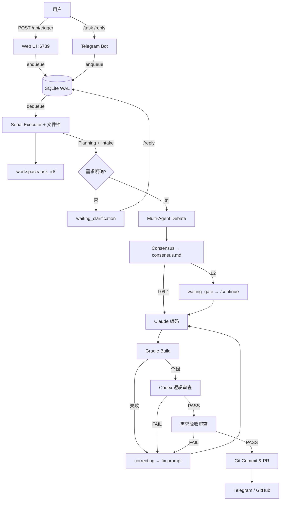
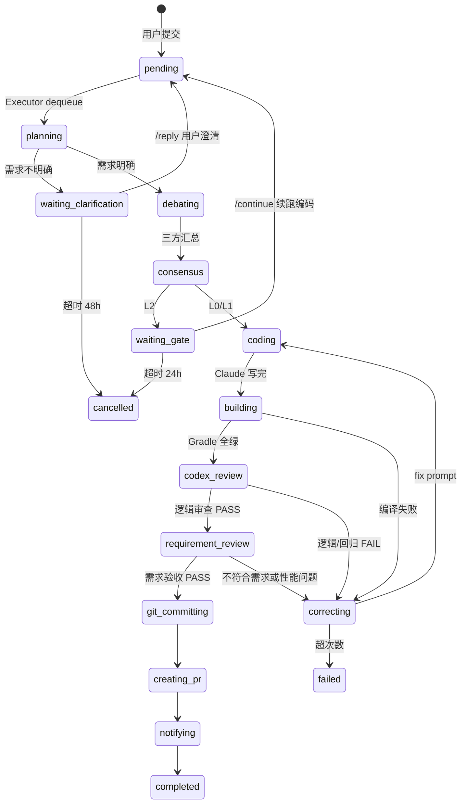

# 🤖 Android Headless Agent 自动化流水线 V3

> 版本: 3.1.0 | Android + Jetpack Compose 多站点项目  
> 核心流派: **Multi-Agent Debate + 可控人工闸门**  
> 目标: 人类扔需求和 Figma；**需求不清时先反问**；方案由 AI 辩论；编码/构建/逻辑审查尽量全自动

---

## V3 核心能力

| 维度 | 说明 |
|------|------|
| **决策机制** | Architect + FigmaAuditor + Guardian **三方辩论** → Consensus 出 `consensus.md` |
| **需求 Intake** | Planning 后若信息不足 → **`waiting_clarification`**，用户 `/reply` 或 Web 澄清后再辩论 |
| **编码契约** | Claude `--print` **只写代码**；Gradle / git / PR 由 Orchestrator 执行 |
| **构建纠错** | Gradle 失败 → `correcting` → fix prompt 重试（`max_retries` 默认 3） |
| **逻辑审查** | 全绿 → `codex_review`（逻辑/漏洞/回归）→ `requirement_review`（对照原始需求 + 明显逻辑/性能），任一 FAIL 再修 |
| **L2 闸门** | 辩论+共识后暂停 `waiting_gate`，`/continue` 或 Web 核准后再编码 |
| **L0 快路径** | 跳过辩论，最小共识后直接编码 |
| **视觉资产** | Code-First：`asset_analysis` → Figma 按需拉取 → `asset_map.json` |
| **图谱上下文** | 可选 `graph_bridge` + CRG HTTP：语义检索 + 影响面（Codex/Architect 用） |

### 与「完全 No-Ask」的区别

| 场景 | 行为 |
|------|------|
| 需求模糊（缺页面/站点/验收标准等） | **必须反问用户**，不进入辩论 |
| L2 复杂任务 | 共识后 **人工核准** 再编码 |
| 编码/构建/审查阶段 | **不向人类提问**，自动 fix |

---

## 系统架构



---

## LangGraph 状态机



持久化：`orchestrator/state_machine.py` + `data/agent.db`（WAL）。非法流转会拒绝并打日志。

---

## 目录结构

```
AICodeAgent/
├── README.md
├── ARCHITECTURE_v3.md          # 详细蓝图
├── setup.md
├── start.sh / stop.sh          # 一键启停
│
├── gateway/
│   ├── web_ui_v2.py            # Web + /api/trigger|continue|reply|cancel
│   └── telegram_bot_v2.py      # /task /reply /continue /cancel
│
├── orchestrator/
│   ├── executor.py             # 串行队列 + 超时清理
│   ├── orchestrator.py           # 主编排（辩论/编码/PR）
│   ├── state_machine.py          # 状态机 + SQLite
│   ├── codex_review.py           # 构建后逻辑/回归审查
│   ├── graph_bridge.py           # CRG 语义检索 / 影响面
│   ├── asset_manager.py          # Figma 资产与 asset_map
│   ├── platform_figma.py         # platform-figma-list 站点解析
│   └── CLAUDE_HEADLESS.md        # Claude 编码契约
│
├── scripts/
│   ├── figma_fetch.sh
│   ├── build_monitor.sh
│   └── ...
│
├── data/                         # 运行时（gitignore）
└── workspace/{task_id}/          # 任务沙箱（gitignore）
    ├── clarification_questions.md
    ├── user_clarification.md
    ├── consensus.md
    ├── codex_review.md
    ├── requirement_review.md
    ├── asset_map.json
    └── ...
```

**部署位置**：本目录默认在 Android 工程根目录下（`wm/AICodeAgent/`），`PROJECT_ROOT` 指向上一级；`start.sh` 依赖该布局。

---

## 快速开始

### 1. 环境依赖

```bash
pip3 install requests   # Telegram 通知等

brew install gh
gh auth login

npm install -g @anthropic-ai/claude-code
# 可选：安装 OpenAI Codex CLI 并设置 CODEX_CMD
```

### 2. 环境变量

```bash
# 必选（构建）
export ANDROID_HOME=$HOME/Library/Android/sdk
export JAVA_HOME=/Applications/Android\ Studio.app/Contents/jbr/Contents/Home
export CLAUDE_CODE_AUTO_ALLOW_BASH=true

# 通知（可选）
export TELEGRAM_BOT_TOKEN=...
export TELEGRAM_CHAT_ID=...

# Web API 认证（建议生产设置）
export AGENT_API_KEY=your-secret

# Figma（UI 类任务）
export FIGMA_TOKEN=...
# site_hint 可从 platform-figma-list 解析，不必手填 FIGMA_FILE_KEY

# 编排超时 / 重试
export AGENT_DEBATE_TIMEOUT=600
export AGENT_CONSENSUS_MAX_RETRY=2
export CODEX_REVIEW_MAX_RETRY=2
export ACCEPTANCE_REVIEW_MAX_RETRY=2
export AGENT_CLARIFICATION_TIMEOUT_HOURS=48
export AGENT_TASK_TOTAL_TIMEOUT=7200

# Codex 审查（可选；未设置则回退 claude --print 审查员）
export CODEX_CMD=""                    # 例: codex exec -a never --
export CODEX_REVIEW_TIMEOUT=900

# 跳过需求反问（调试）
# export AGENT_SKIP_CLARIFICATION=1

# Code Review Graph（可选）
export CRG_AUTO_START=1
export CRG_HTTP_URL=http://127.0.0.1:5555
```

### 3. 启动

```bash
# 推荐：在 Android 工程根目录
./AICodeAgent/start.sh

# 或手动
python3 AICodeAgent/orchestrator/executor.py &
python3 AICodeAgent/gateway/web_ui_v2.py
python3 AICodeAgent/gateway/telegram_bot_v2.py
```

### 4. 提交任务

**Web**（需 `Authorization: Bearer $AGENT_API_KEY` 若已配置）：

```bash
curl -X POST http://localhost:6789/api/trigger \
  -H "Content-Type: application/json" \
  -H "Authorization: Bearer $AGENT_API_KEY" \
  -d '{"raw_requirement":"在 strings.xml 增加 clear_cache","level":"L0"}'

# 需求澄清后
curl -X POST http://localhost:6789/api/reply \
  -H "Content-Type: application/json" \
  -H "Authorization: Bearer $AGENT_API_KEY" \
  -d '{"task_id":"abc12345","reply":"目标站点 haobo，改 SettingsScreen 清除缓存按钮"}'

# L2 共识后核准
curl -X POST http://localhost:6789/api/continue \
  -H "Authorization: Bearer $AGENT_API_KEY" \
  -d '{"task_id":"abc12345"}'
```

**Telegram**：

```text
/task L1 haobo 在设置页加清除缓存
/reply <task_id> 目标页面是 SettingsScreen，仅 haobo 站点
/continue <task_id>          # L2 核准
/status <task_id>
/cancel <task_id>
```

---

## 任务等级

| 等级 | 流程摘要 |
|------|----------|
| **L0** | Planning →（澄清?）→ **跳过辩论** → 编码 → 构建 → Codex → PR |
| **L1** | Planning →（澄清?）→ 辩论 → 共识 → 编码 → … |
| **L2** | 同 L1，共识后 **waiting_gate**，人工 `/continue` 后续跑 |
| **auto** | 按需求文本自动判定 L0/L1/L2 |

---

## 关键设计

1. **先澄清再辩论**：Intake Agent 用 `claude --print` 输出 JSON；不明确则写 `clarification_questions.md` 并通知用户。
2. **两阶段审查**：`codex_review`（回归/漏洞）通过后，`requirement_review` 对照 **原始需求** 与变更源码，查遗漏与明显逻辑/性能问题；报告见 `requirement_review.md`。
3. **续跑标志**：`resume_from_gate`（L2）、`resume_after_clarification`（澄清后）— 任务回到 `pending` 由 Executor 再次 `process_task`。
4. **安全边界**：`apply_code_changes` 黑名单（`jg_tools/`、`Configs.kt`、keystore 等）；任务结束恢复 `Configs.kt` 与 git 工作区。
5. **串行执行**：单 Executor + 文件锁，避免多任务同时改同一 git tree。

---

## 与 wm 开发协议

| 组件 | 对接 |
|------|------|
| `doc/dev_protocol_android.md` 九阶段 | 辩论≈设计阶段；L2 `waiting_gate`≈人工核准；**非**全流程自动 `[继续执行]` |
| `doc/tasks/{name}/` | 任务产物在 `workspace/{task_id}/` |
| `SiteRules` / 多站点 | Guardian + Codex 审查 enName 比较规范 |
| code-review-graph | `graph_bridge.py`，`start.sh` 可 `CRG_AUTO_START=1` |

---

## 扩展计划

- [x] Visual Asset Manager + `asset_map.json`
- [x] Code Review Graph 桥接（`graph_bridge.py`）
- [x] L2 `/continue` 续跑编码
- [x] 需求澄清门（`waiting_clarification` + `/reply`）
- [x] 构建后 Codex 逻辑审查（`codex_review.py`）
- [ ] Maestro 流程测试
- [ ] Paparazzi + Figma 基线对比
- [ ] 多站点并行 PR
- [ ] 企业微信/钉钉通知
- [ ] 向量 RAG（替代关键词检索）

---

详细设计见 [ARCHITECTURE_v3.md](./ARCHITECTURE_v3.md)，环境见 [setup.md](./setup.md)。
